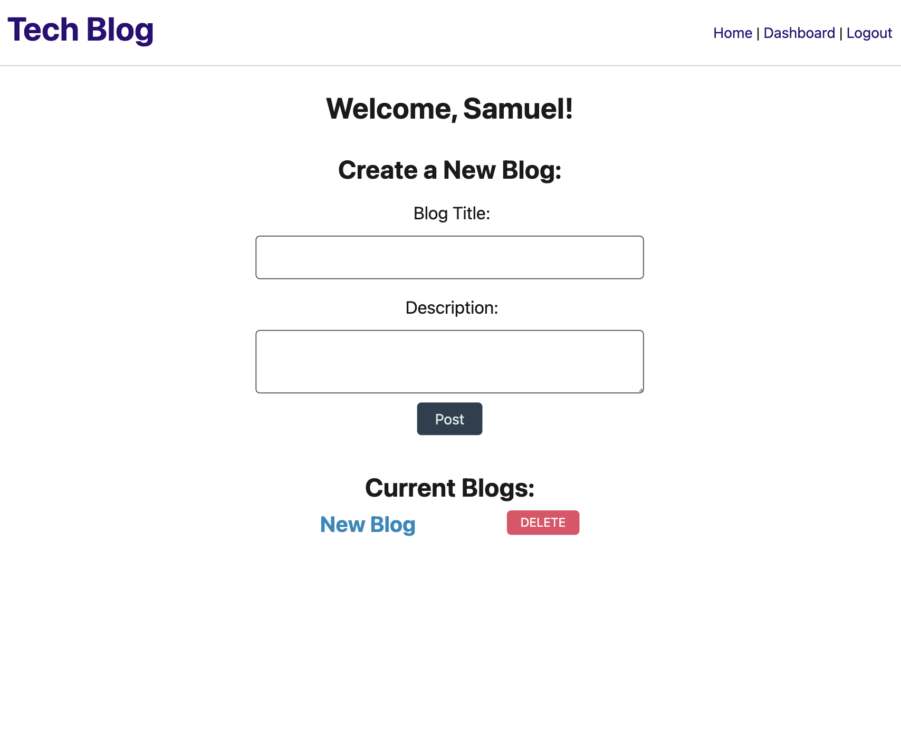

 https://opensource.org/licenses/MIT
  
  # Tech-Blog
  
  ## Description:
  This is a project that has required the use of the Model-View-Controller paradigm in order to complete. Utilising express, bycrypt, sequalize, dotenv, handlebars and mySQL, the project's goal is to create a blog that allows users to sign up, login, post blogs, delete said blogs and also comment on blogs. 
  
  ## Table of contents:
  - [Installation](#installation)
  - [Usage](#usage)
  - [Contribution](#contribution)
  - [Test](#test)
  - [License](#license)
  - [Questions](#questions)

  ## Installation
  run 'npm i' to install all dependencies

  ## Usage
  free to use

  ## Contribution
  free to contribute

  ## Test
  no tests as of yet

  ## License
  MIT

  ## Images
  
  

  ## URL to deployed site
  https://lit-mesa-19708.herokuapp.com/

  ## Questions
  Github: https://github.com/SamuelHeal
  Email: samuelheal@hotmail.com
  
